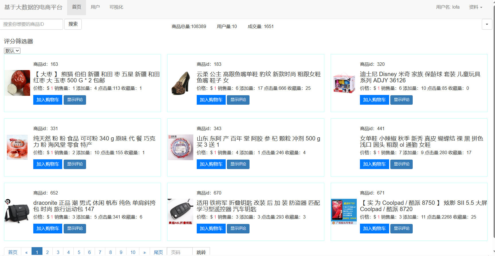

# 个人项目展示
项目名称：基于大数据架构的电商平台的设计与实现
使用的技术：Python、Django、Hadoop、MySQL等
通过分析电商数据来对用户进行商品推荐 ,该项目使用到了Hadoop、Spark、MySQL来采集处理存储数据，借助Django搭建项目框架，最终实现数据可视化的目的。          
项目负责：参与数据的预处理工作，将处理后的数据加载到MySQL数据库中，实现了对电商数据的采集、转换、加载，为团队提供了较干净的展示数据。

